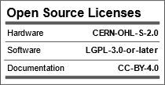
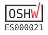

# TFG Cristina Fernández

## Project documentation in wiki: https://github.com/URJCMakerGroup/TFG-Cristina-Fernandez/wiki

## License

Hardware License: [CERN-OHL-S 2.0](cern_ohl_s_v2.txt)

Software License: [LGPL 3.0 or later](License.md)

Documentation License: [CC BY 4.0](https://creativecommons.org/licenses/by/4.0/)

This project has been certified as [open source hardware](https://certification.oshwa.org/es000021.html) by the [Open Source Hardware Association](https://www.oshwa.org/). 

## Organización de las carpetas:

- FreeCAD: archivo creado por FreeCAD
- comps: copia del reposiorio fcad-comps de Felipe Machado
- img: imágenes de las piezas
- src: código fuente
- step: archivo de modelo 3D formateado en STEP
- stl: archivo de modelo 3D en formato estándar que puede ser leído epor múltiples aplicaciones CAD

## Piezas:

- ### [Soporte Eje Y](https://github.com/URJCMakerGroup/TFG---Cristina---Fernandez/blob/main/src/base_class.py)

 

- ### [Soporte motor](https://github.com/URJCMakerGroup/TFG-Cristina-Fernandez/blob/main/src/NemaMotorHolder_class.py)

 

- ### [Soporte tuerca husillo](https://github.com/URJCMakerGroup/TFG---Cristina---Fernandez/blob/main/src/board_class.py)

 

